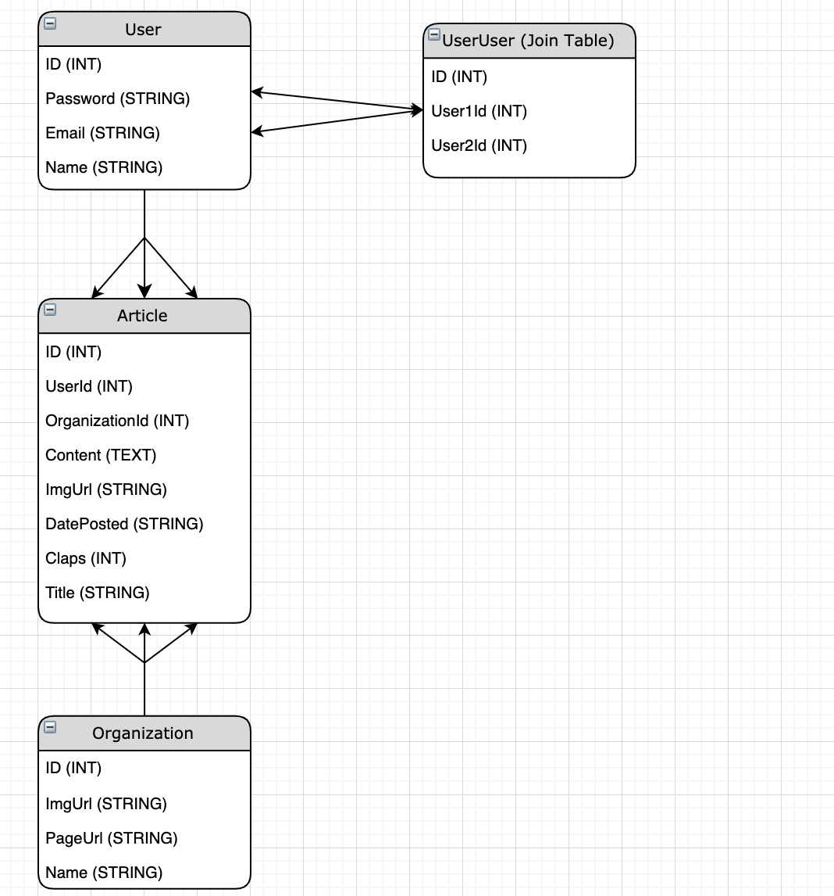

# Medium Clone

## Purpose

I wanted to learn technologies in web development that I didn't know but am curious about, specifically: React Hooks, GraphQL, and Golang. I believe that the best way to learn is to tackle a project and use the technologies that you want to learn as doing so gives firsthand experience. The first thought that came to mind was to create a clone of Medium as, aside from the recommendation engine and the editor, Medium is a basically a CRUD app that can be leveraged to be more or less complicated depending on how I decide to architech my clone. I wanted to do this project properly i.e. create a very good backend schema, choose the right database, choose a design architecture for the front end, and then work on styling. As such, I've decided to create a very comprehensive readme to keep me on this path. I had to design a very comprehensive and attainable MVP because I start officially working on the 13th and would like to do as much as I can beforehand.

##### NOTE

I've structured this so that, if you'd like to tackle this project too, you can. Feel free to fork this repo, clear the main.go file, reset app.jsx, and empty the components folder. For simplicity, I am not considering adding comments. You may do so if you'd like.

### Tiers of completion

#### Tier 1: MVP

-  Users should be able to see a list of articles stored within a chosen database
-  Users should be able to click on an article to get a more comprehensive view of it
-  Users should be able to post an article - Editor can be html as a begining step
-  Style as you go

#### Tier 2

-  Users should be able to login
-  Users can see and edit articles they've posted
-  Guests should not be able to post or edit articles
-  Users should be able to upvote an article
-  Style as you go

#### Tier 3

-  Reccomendation engine based on the user's last 10 articles read (can do a more complicated engine if you have time)
-  Reccomendation engine should work for guests too => Local storage is an option
-  Users can have followers
-  Users can follow other users

### Step 1 - Backend Schema (System Design)

To create the backend schema, I first considered the information that I definitely need to have: Articles and Users. Next, I thought about what each article and user should have. I broke it down based on the information that is available on a regular medium article:

| Article                         |
| ------------------------------- |
| ID (Primary Key - INT)          |
| UserId (Secondary Key - INT)    |
| Content (TEXT)                  |
| PostedOn (STRING)               |
| ImgUrl (STRING)                 |
| DatePosted (STRING or DATE OBJ) |
| Claps (INT)                     |

| User                     |
| ------------------------ |
| ID (Primary Key - INT)   |
| Password (HASHED STRING) |
| ImgUrl (STRING)          |
| Email (STRING)           |

We also have to add another piece of data here: the organization the article is associated with. To do this, we replace PostedOn with a foreign key, and create another table:

| Article                              |
| ------------------------------------ |
| ID (Primary Key - INT)               |
| UserId (Secondary Key - INT)         |
| Content (TEXT)                       |
| OrganizationId (Secondary Key - INT) |
| ImgUrl (STRING)                      |
| DatePosted (STRING or DATE OBJ)      |
| Claps (INT)                          |

| Organization           |
| ---------------------- |
| ID (Primary Key - INT) |
| ImgUrl (STRING)        |
| PageUrl (STRING)       |

Next, we have to consider relationships. I've already added a UserId to articles as a single user owns an article, i.e. by writing it (one to many). I've also done so for organizations and articles as one organization can be associated with many articles (one to many). We also have to add one more relationship, the many to many relationship between two users. Any given user can follow many users and can be followed by many users. To create a many to many relationship, we have to use a join table. I'll call this table UserUser:

| UserUser                      |
| ----------------------------- |
| ID (Primary Key - INT)        |
| User1Id (Secondary Key - INT) |
| User2Id (Secondary Key - INT) |

This leaves us with four total tables:

| Article                              |
| ------------------------------------ |
| ID (Primary Key - INT)               |
| UserId (Secondary Key - INT)         |
| Content (TEXT)                       |
| OrganizationId (Secondary Key - INT) |
| ImgUrl (STRING)                      |
| DatePosted (STRING or DATE OBJ)      |
| Claps (INT)                          |

| User                     |
| ------------------------ |
| ID (Primary Key - INT)   |
| Password (HASHED STRING) |
| ImgUrl (STRING)          |
| Email (STRING)           |

| UserUser                      |
| ----------------------------- |
| ID (Primary Key - INT)        |
| User1Id (Secondary Key - INT) |
| User2Id (Secondary Key - INT) |

| Organization           |
| ---------------------- |
| ID (Primary Key - INT) |
| ImgUrl (STRING)        |
| PageUrl (STRING)       |

Here's an image of the schema with arrows:



#### Database Selection

It makes a lot of sense to use a NoSQL database like MongoDB for an application like this because there is probably a heavier read to write ratio as users are more likely to load articles rather than write or edit them. But, in my particular case, a SQL database is a good choice as well. I don't have to optimize read times because I don't have a heavy focus on user to user interaction and, with my schema, I am not really loading much information per article. Also, if I use a SQL database, I can utilize relationships to have more structured data. In this case it'd be fine to go with either, but I'm opting in for SQL because the advantages of NoSQL do not outweigh the advantages of SQL in my particular approach of this medium clone.

I can also use an external storage sevice like AWS to store all my images, but I'll offload that and just use free stock photo image urls.

#### Caching

An 20 to 80 cache makes alot of sense here: 80% of the traffic to the website will likely be looking at 20% of the most popular articles which means caching the top 20% articles can greatly improve the user experience for the majority of our users

#### Rate limiting

To protect against attacks, we can rate limit a user's ability to make api calls limited by day. This protects against ddos attacks and is what Medium uses to push their premium membership.

#### API Routes

```
// Articles
GET /api/articles => Loads all of the articles an includes author and org information. If we set up caching, we only have to load all the articles on a fixed interval to update the cache
   * Query params: search = top => Loads the top 4 articles based on total claps. This route isn't super necessary but isn't an expensive API call. If we set up our cache to save the top 20% articles based on claps, we can always just grab the top 4 items in our cache.
GET /api/articles/:articleId => loads an article by ID
POST /api/articles => Allows a user to post a new article, MUST BE LOGGED IN. This route will return the created article on a successful post
PUT /api/articles/:articleId => Allows a user to edit an article that they posted, MUST BE LOGGED IN. This route will return the article on a successful put.
DELETE /api/articles/:articleId => Allows a user to delete an article they posted, MUST BE LOGGED IN. Returns true if successful.

// Users
GET /api/user/:userId => loads information for given user, will mostly be used for authentication
PUT /api/user/:userId => allows a user to update their account
DELETE /api/user/:userId => allows a user to remove their account

```
